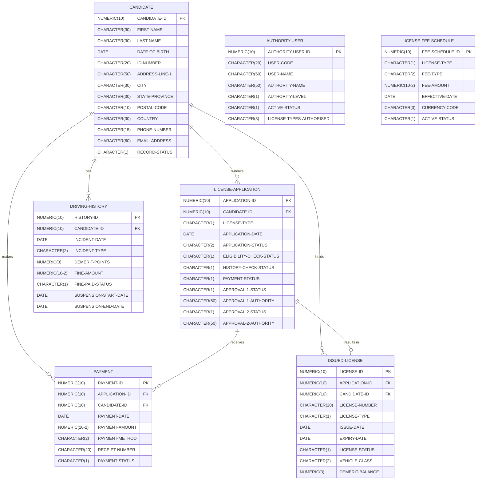
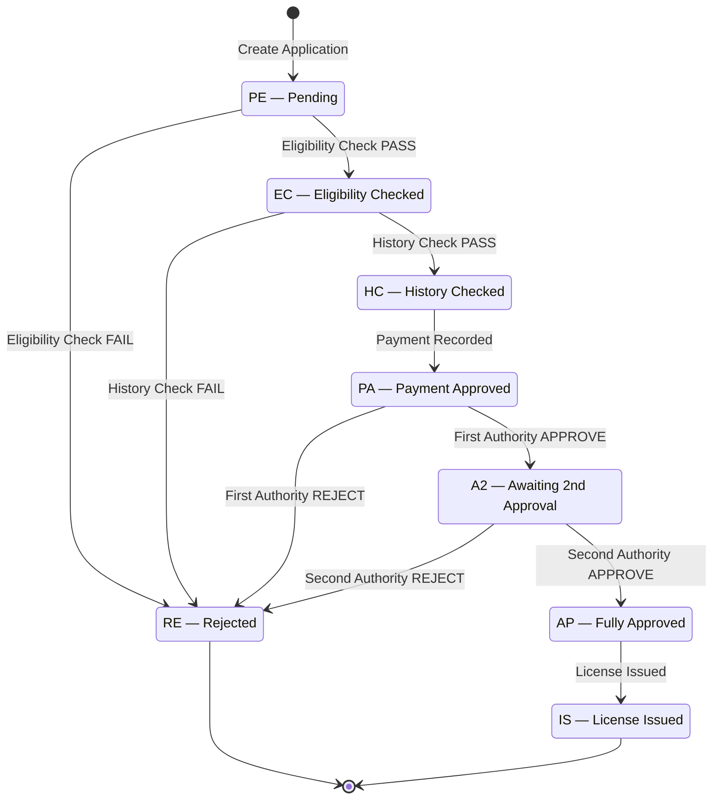
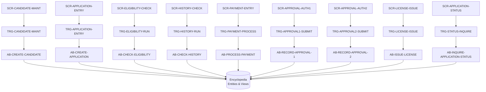

# 01 — System Architecture
## Driver License Issuance System (DLIS)

---

## 1. Architectural Overview

DLIS is built on the **CA Gen Information Engineering** methodology. It is structured across three layers:

| Layer | CA Gen Artefact | Purpose |
|---|---|---|
| **Data Layer** | Entities, Views | Persistent data model — encyclopedia-managed |
| **Logic Layer** | Action Blocks, Business Functions | All procedural rules and validations |
| **Presentation Layer** | Screen Maps, Triggers | User interface and event handling |

The **CA Gen Generator** produces executable target code (COBOL/CICS or C/Java) from these model artefacts. The encyclopedia is the single source of truth — no logic exists outside it.

---

## 2. CA Gen Toolset Layers

```
┌─────────────────────────────────────────────────────────────┐
│                    PRESENTATION LAYER                       │
│   Screen Maps (.SCR)    ←→   Triggers (.TRG)                │
│   SCR-MAIN-MENU                TRG-CANDIDATE-MAINT          │
│   SCR-CANDIDATE-MAINT          TRG-APPLICATION-ENTRY        │
│   SCR-APPLICATION-ENTRY        TRG-CHECK-AND-STATUS         │
│   SCR-ELIGIBILITY-CHECK        TRG-PAYMENT-APPROVAL-ISSUE   │
│   SCR-HISTORY-CHECK                                         │
│   SCR-PAYMENT-ENTRY                                         │
│   SCR-APPROVAL-AUTH1                                        │
│   SCR-APPROVAL-AUTH2                                        │
│   SCR-LICENSE-ISSUE                                         │
│   SCR-APPLICATION-STATUS                                    │
├─────────────────────────────────────────────────────────────┤
│                      LOGIC LAYER                            │
│   Business Functions (.BFN)   Action Blocks (.ACB)          │
│   BF-CANDIDATE-MANAGEMENT     AB-CREATE-CANDIDATE           │
│   BF-LICENSE-APPLICATION      AB-CREATE-APPLICATION         │
│   BF-ELIGIBILITY-CHECK        AB-CHECK-ELIGIBILITY          │
│   BF-HISTORY-CHECK            AB-CHECK-HISTORY              │
│   BF-PAYMENT-PROCESSING       AB-PROCESS-PAYMENT            │
│   BF-APPROVAL-AUTHORITY-1     AB-RECORD-APPROVAL-1          │
│   BF-APPROVAL-AUTHORITY-2     AB-RECORD-APPROVAL-2          │
│   BF-LICENSE-ISSUANCE         AB-ISSUE-LICENSE              │
│   BF-LICENSE-INQUIRY          AB-INQUIRE-APPLICATION-STATUS │
├─────────────────────────────────────────────────────────────┤
│                       DATA LAYER                            │
│   Entities (.ENT)             Views (.VEW)                  │
│   CANDIDATE                   24 scoped views across        │
│   LICENSE-APPLICATION         6 view files                  │
│   DRIVING-HISTORY                                           │
│   PAYMENT                                                   │
│   ISSUED-LICENSE                                            │
│   AUTHORITY-USER                                            │
│   LICENSE-FEE-SCHEDULE                                      │
└─────────────────────────────────────────────────────────────┘
                           ↕  CA Gen Generator
┌─────────────────────────────────────────────────────────────┐
│               GENERATED TARGET PLATFORM                     │
│     COBOL + CICS + DB2 (Mainframe)  /  Java (Web)           │
└─────────────────────────────────────────────────────────────┘
```

---

## 3. Entity-Relationship Diagram (ERD)



---

## 4. Application Status State Machine



---

## 5. Action Block Call Chain



---

## 6. View Layer Architecture

Each Action Block operates exclusively through **Views** — never directly on entities. This enforces:
- **Minimal privilege** — each view exposes only the attributes required for the operation
- **Decoupling** — action block logic does not depend on entity physical layout
- **Reusability** — views can be shared across multiple action blocks

| View Category | Example | Used By |
|---|---|---|
| ALL views | `VAPPLICATION-ALL` | Inquiry and full-read operations |
| CREATE views | `VAPPLICATION-CREATE` | Insert new record operations |
| UPDATE views | `VAPPLICATION-ELIGIBILITY-UPD` | Targeted field updates |
| LOOKUP views | `VCANDIDATE-ID-LOOKUP` | Key-based lookups |
| CHECK views | `VHISTORY-CHECK` | Business rule evaluation |
| RECEIPT views | `VPAYMENT-RECEIPT` | Output/print operations |

---

## 7. Security & Segregation of Duties

| Control | Implementation |
|---|---|
| Dual approval required | Two separate `AUTHORITY-USER` records with `AUTHORITY-LEVEL` 1 and 2 |
| Different approvers enforced | `AB-RECORD-APPROVAL-2` rejects if `APPROVAL-1-AUTHORITY = APPROVAL-2-AUTHORITY` |
| License type authorisation | `LICENSE-TYPES-AUTHORISED` field restricts which types each officer may approve |
| Sequential gate enforcement | Each AB checks preceding step status before proceeding |
