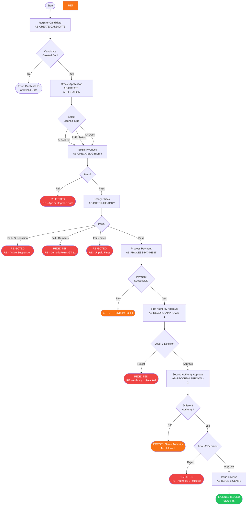
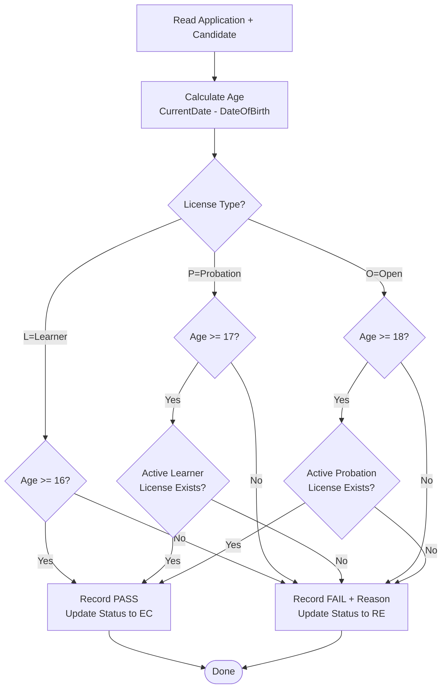
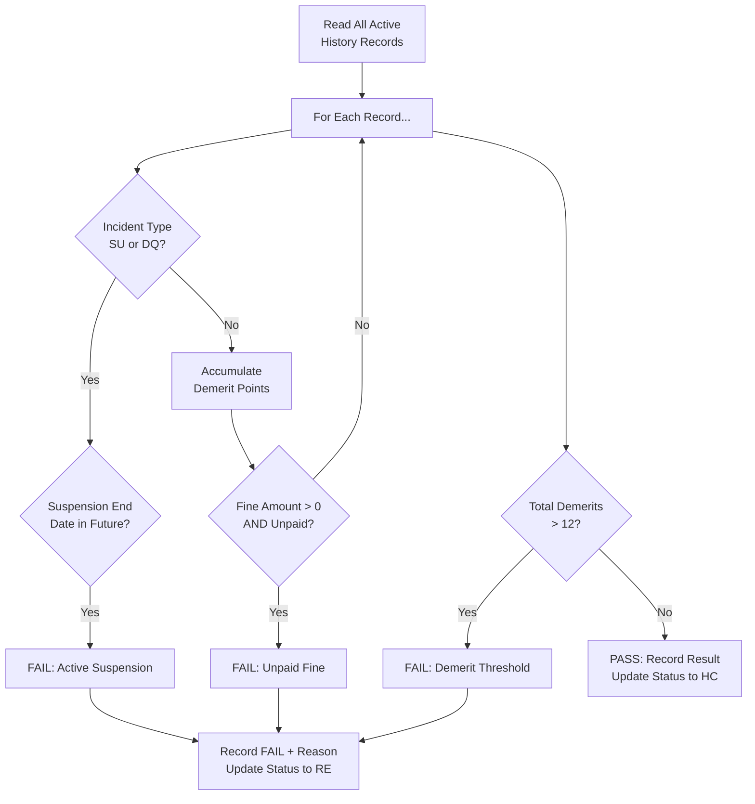
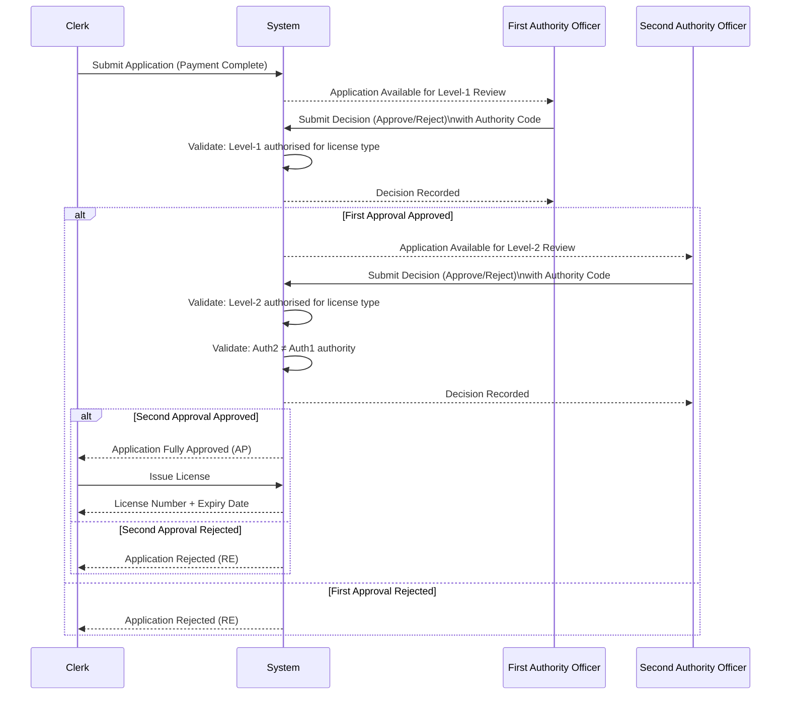
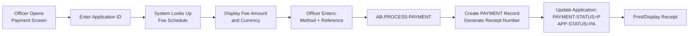

# 02 — Process Flow & Workflow
## Driver License Issuance System (DLIS)

---

## 1. End-to-End Process Overview

The DLIS workflow is a strictly sequential, gate-controlled pipeline. Each stage must pass before the next can begin. A failure at any gate results in the application being **Rejected (RE)** and no further processing occurs.

```
┌──────────────────────────────────────────────────────────────────────────┐
│                  DRIVER LICENSE ISSUANCE WORKFLOW                        │
│                                                                          │
│  ┌─────────┐    ┌─────────┐    ┌─────────┐    ┌─────────┐              │
│  │  STEP 1 │    │  STEP 2 │    │  STEP 3 │    │  STEP 4 │              │
│  │Register │───▶│ Submit  │───▶│Eligible │───▶│ History │              │
│  │Candidate│    │   App   │    │  Check  │    │  Check  │              │
│  └─────────┘    └─────────┘    └────┬────┘    └────┬────┘              │
│                                     │ FAIL         │ FAIL              │
│                                     ▼              ▼                   │
│                                 ┌───────┐      ┌───────┐              │
│                                 │REJECT │      │REJECT │              │
│                                 └───────┘      └───────┘              │
│                                                                         │
│  ┌─────────┐    ┌─────────┐    ┌─────────┐    ┌─────────┐             │
│  │  STEP 5 │    │  STEP 6 │    │  STEP 7 │    │  STEP 8 │             │
│  │ Payment │───▶│  Auth 1 │───▶│  Auth 2 │───▶│  Issue  │             │
│  │         │    │Approval │    │Approval │    │License  │             │
│  └─────────┘    └────┬────┘    └────┬────┘    └─────────┘             │
│                      │ REJECT       │ REJECT                          │
│                      ▼              ▼                                  │
│                  ┌───────┐      ┌───────┐                             │
│                  │REJECT │      │REJECT │                             │
│                  └───────┘      └───────┘                             │
└──────────────────────────────────────────────────────────────────────────┘
```

---

## 2. Detailed Process Flow Diagram



---

## 3. Application Status Lifecycle

Each application record tracks its position in the pipeline via the `APPLICATION-STATUS` field:

| Status Code | Description | Next Action |
|---|---|---|
| `PE` | Pending — application submitted | Run Eligibility Check |
| `EC` | Eligibility Checked and passed | Run History Check |
| `HC` | History Checked and passed | Process Payment |
| `PA` | Payment Approved | Submit First Approval |
| `A2` | Awaiting Second Authority Approval | Submit Second Approval |
| `AP` | Fully Approved — all gates passed | Issue License |
| `IS` | License Issued | Terminal state |
| `RE` | Rejected | Terminal state |

> **Note:** Status `A1` (Awaiting First Approval) is a display alias — the transition from `PA` to `A2` is recorded atomically when Auth 1 approves.

---

## 4. Eligibility Check Logic



---

## 5. History Check Logic



---

## 6. Dual Approval Segregation



---

## 7. Payment Process Flow



---

## 8. License Issuance — Expiry Calculation

| License Type | Validity Period | Example: Issued 01/01/2025 |
|---|---|---|
| L — Learner | **1 year** | Expires 01/01/2026 |
| P — Probation | **2 years** | Expires 01/01/2027 |
| O — Open | **5 years** | Expires 01/01/2030 |

License number format: `{TYPE-PREFIX}{VEHICLE-CLASS}{CANDIDATE-ID}{APPLICATION-ID}`

| Prefix | License Type |
|---|---|
| `LRN` | Learner |
| `PRB` | Probation |
| `OPN` | Open |

Vehicle Classes: `A`=Motorcycle, `B`=Light Vehicle, `C`=Heavy Vehicle, `D`=Bus/Coach
