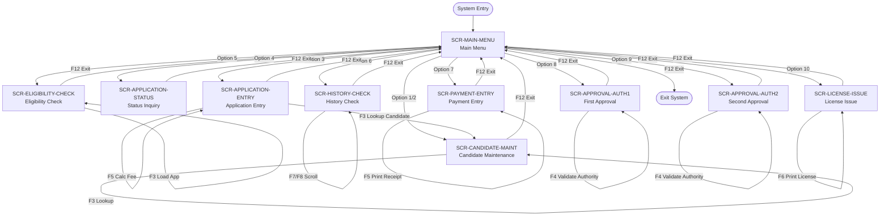

# 03 — Screen Navigation Map
## Driver License Issuance System (DLIS)

---

## 1. Screen Inventory

| Screen ID | Title | Type | Access From |
|---|---|---|---|
| `SCR-MAIN-MENU` | Main Menu | Menu | Entry point |
| `SCR-CANDIDATE-MAINT` | Candidate Maintenance | Data Entry | Menu option 1 or 2 |
| `SCR-APPLICATION-ENTRY` | License Application Entry | Data Entry | Menu option 3 |
| `SCR-ELIGIBILITY-CHECK` | Eligibility Check | Data Entry | Menu option 5 |
| `SCR-HISTORY-CHECK` | Driving History Check | Data Entry | Menu option 6 |
| `SCR-PAYMENT-ENTRY` | Payment Entry | Data Entry | Menu option 7 |
| `SCR-APPROVAL-AUTH1` | First Authority Approval | Data Entry | Menu option 8 |
| `SCR-APPROVAL-AUTH2` | Second Authority Approval | Data Entry | Menu option 9 |
| `SCR-LICENSE-ISSUE` | License Issuance | Data Entry | Menu option 10 |
| `SCR-APPLICATION-STATUS` | Application Status Inquiry | Inquiry | Menu option 4 |

---

## 2. Navigation Flow Diagram



---

## 3. PF-Key Reference by Screen

### SCR-MAIN-MENU

| Key | Action |
|---|---|
| ENTER | Navigate to selected option |
| F12 | Exit system |

---

### SCR-CANDIDATE-MAINT

| Key | Trigger | Action |
|---|---|---|
| F1 | `TRG-CANDIDATE-CREATE` | Create new candidate → `AB-CREATE-CANDIDATE` |
| F2 | `TRG-CANDIDATE-UPDATE` | Update existing candidate |
| F3 | `TRG-CANDIDATE-INQUIRE` | Inquire by Candidate ID or National ID |
| F4 | `TRG-CANDIDATE-DEACTIVATE` | Deactivate candidate record |
| F12 | — | Return to Main Menu |

**Fields:**
- `CANDIDATE-ID` — system-assigned on create; used as key on inquiry/update
- `ID-NUMBER` — alternate search key (national ID / passport)
- `RECORD-STATUS` — defaults to `A` (Active)

---

### SCR-APPLICATION-ENTRY

| Key | Trigger | Action |
|---|---|---|
| F1 | `TRG-APPLICATION-SUBMIT` | Submit application → `AB-CREATE-APPLICATION` |
| F3 | `TRG-CANDIDATE-LOOKUP` | Populate candidate name from ID |
| F5 | `TRG-FEE-CALCULATE` | Display applicable fee for selected license type |
| F12 | — | Return to Main Menu |

**Fields:**
- `CANDIDATE-ID` — required input
- `LICENSE-TYPE` — required: `L`, `P`, or `O`
- `APPLICATION-ID` — populated by system after submit

---

### SCR-ELIGIBILITY-CHECK

| Key | Trigger | Action |
|---|---|---|
| F1 | `TRG-ELIGIBILITY-RUN` | Execute eligibility check → `AB-CHECK-ELIGIBILITY` |
| F3 | `TRG-APPLICATION-LOOKUP` | Load application details |
| F12 | — | Return to Main Menu |

**Displays:** Candidate age, minimum age requirement, prior license status, check result

---

### SCR-HISTORY-CHECK

| Key | Trigger | Action |
|---|---|---|
| F1 | `TRG-HISTORY-RUN` | Execute history check → `AB-CHECK-HISTORY` |
| F3 | `TRG-APPLICATION-LOOKUP` | Load application details |
| F7 | — | Scroll history list up |
| F8 | — | Scroll history list down |
| F12 | — | Return to Main Menu |

**Displays:** Scrollable history list (7 rows), total demerit points, active suspension flag, unpaid fines flag

---

### SCR-PAYMENT-ENTRY

| Key | Trigger | Action |
|---|---|---|
| F1 | `TRG-PAYMENT-PROCESS` | Record payment → `AB-PROCESS-PAYMENT` |
| F3 | `TRG-APPLICATION-LOOKUP` | Load application details |
| F5 | `TRG-RECEIPT-PRINT` | Print payment receipt |
| F12 | — | Return to Main Menu |

**Fields:**
- `PAYMENT-METHOD` — `CC`, `DC`, `EF`, `CS`, `CH`
- `PAYMENT-REFERENCE` — bank/gateway reference number

---

### SCR-APPROVAL-AUTH1

| Key | Trigger | Action |
|---|---|---|
| F1 | `TRG-APPROVAL1-SUBMIT` | Submit decision → `AB-RECORD-APPROVAL-1` |
| F3 | `TRG-APPLICATION-LOOKUP` | Load application |
| F4 | `TRG-AUTHORITY-VALIDATE` | Validate authority user code |
| F12 | — | Return to Main Menu |

**Fields:**
- `AUTHORITY-USER-CODE` — must be a level-1 active officer for this license type
- `DECISION` — `A`=Approve or `R`=Reject

---

### SCR-APPROVAL-AUTH2

| Key | Trigger | Action |
|---|---|---|
| F1 | `TRG-APPROVAL2-SUBMIT` | Submit decision → `AB-RECORD-APPROVAL-2` |
| F3 | `TRG-APPLICATION-LOOKUP` | Load application |
| F4 | `TRG-AUTHORITY-VALIDATE` | Validate authority user code |
| F12 | — | Return to Main Menu |

**Fields:**
- `AUTHORITY-USER-CODE` — must be level-2 active officer; **must differ from Auth1**
- Screen displays first approver name for awareness

---

### SCR-LICENSE-ISSUE

| Key | Trigger | Action |
|---|---|---|
| F1 | `TRG-LICENSE-ISSUE` | Issue license → `AB-ISSUE-LICENSE` |
| F3 | `TRG-APPLICATION-LOOKUP` | Load application |
| F6 | `TRG-LICENSE-PRINT` | Print physical license card |
| F12 | — | Return to Main Menu |

**Fields:**
- `VEHICLE-CLASS` — `A`, `B`, `C`, or `D`
- `RESTRICTIONS` — free-text (e.g., "Corrective Lenses Required")
- `ISSUED-BY-OFFICER` / `ISSUED-BY-AUTHORITY` — required inputs

---

### SCR-APPLICATION-STATUS

| Key | Trigger | Action |
|---|---|---|
| ENTER | `TRG-STATUS-INQUIRE` | Retrieve status → `AB-INQUIRE-APPLICATION-STATUS` |
| F12 | — | Return to Main Menu |

**Displays:** All 5 pipeline steps with status, date and notes; license number if issued

---

## 4. Screen Layout Conventions

All DLIS screens follow consistent layout standards:

```
ROW  1 : Screen title banner (80 chars)
ROW  2 : Separator line (─────)
ROW  4+: Input / output fields
ROW 22 : Message area (green = success, red = error)
ROW 23 : Separator line
ROW 24 : PF-key legend
```

- All dates display as `DD/MM/YYYY`
- Numeric IDs display as `Z(9)9` (suppress leading zeros)
- Currency amounts display as `ZZZ,ZZ9.99`
- Message field colour changes to **red** on error, **green** on success
